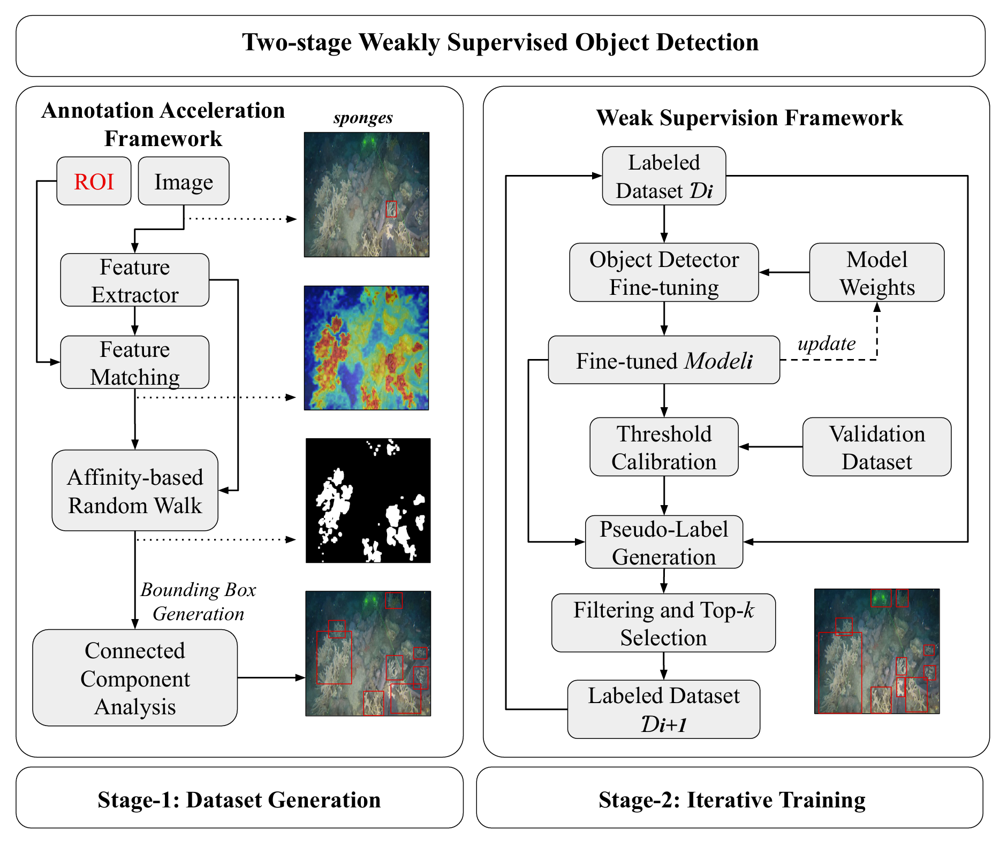

# Reducing Annotation Burden in Benthic Ecology: Weak Supervision for Automated Detection of Seafloor Sediment-Linked Features

Sediment-linked benthic features provide evidence of ecological processes but remain difficult to analyse at scale because exhaustive box-level annotation is time-consuming and requires ecological expertise. We present a two-phase weakly supervised object detection framework that reduces reliance on dense manual annotations. In the first phase, one seed bounding box for each class present in an image is represented using dense DINOv3 features. Seed-conditioned similarity and affinity-based random-walk refinement identify related regions within the same image and convert them into initial pseudo-labelled boxes. In the second phase, an object detector iteratively expands the training set using validation-calibrated confidence thresholds, augmentation-consistency filtering, duplicate removal, non-maximum suppression, and class-wise top-$k$ selection. This combination of feature-guided seed propagation and controlled pseudo-label selection is the main methodological contribution.

We first evaluated the framework on a controlled binary-burrow benchmark with 10,072 exhaustive annotations. Using 350 seed boxes, 96.5% fewer manually provided boxes than full supervision, the best weakly supervised model achieved an mAP50 of 0.821, retaining 86.5% of the fully supervised baseline performance. We then applied the framework to a more complex ten-class sediment-feature dataset, where the generated annotations underwent one-time expert verification before iterative training. On its fully annotated test set, the final detector achieved an mAP50 of 0.838, precision of 0.762, recall of 0.746, and an F1 score of 0.754. These results show that the framework can support annotation-efficient detector development for visually repetitive benthic features, while expert review remains important in complex multi-class imagery.



---

## Datasets

### Burrow benchmark (included with the repository)

The **burrow dataset** is bundled with this repository. You will find it at:

- **`burrow_experiment/dataset_burrow/`** — used for weakly supervised YOLO training and evaluation
- **`feature_matching_scripts/dataset_burrow/`** — used for the annotation acceleration pipeline (seed drawing and pseudo-label generation)

This benchmark was built from the publicly available Nephrops (*Nephrops norvegicus*) dataset from Irish underwater television surveys (Melvin et al., 2024). The original release provides fine-grained annotations of selected Nephrops burrow types and states rather than exhaustive annotations of all visible burrows, and includes overlapping frames from survey transects. We selected **350 images** and exhaustively annotated all visible burrows, yielding **10,072 bounding boxes** for binary burrow detection.

### Seafloor sediment-linked feature dataset (download required)

Images were collected with a **GoPro Hero 12** camera mounted on a sledge towed over seafloor sediment habitats surrounding **Coromandel Peninsula Channel Island / Motu Takapu, New Zealand**. The dataset covers ten sediment-linked feature classes (anemones, bryozoans, burrows, divets, fanworms, horse mussel shells, hydroids, mounds, and two sponge categories) with training images, pseudo training labels (verified/filtered by experts), fully annotated validation and test splits.

Download the dataset archive from:

**[Dropbox — images](https://www.dropbox.com/scl/fo/of47g4cw9j3xhpee1w7a0/APzHdSv6VyfOztcU2ngWoZM?rlkey=jz2p56joik6mxnzhrerpydaan&st=uz81j4nj&dl=0)**

Extract "images" folder and place it in "detector_dataset_simple" at the **repository root** so you have a folder like:

```text
detector_dataset_simple/
  data.yaml
  train.txt
  val.txt
  test.txt
  images/
  labels/
```

Open `detector_dataset_simple/data.yaml` and set `path` to your local dataset directory (for example `./detector_dataset_simple`). This folder is required for evaluation and retraining steps described later in this README.

---

## 1. Clone the repository

```bash
git clone https://github.com/shahrokh1106/seafloor_sediment_feature_localization_via_weak_supervision_on_on_partially_labelled_dataset.git
cd <repo-dir>
```

---

## 2. Create a Python environment

Use **Python 3.10+**.

```powershell
python -m venv detenv
detenv\Scripts\activate
```

---

## 3. Install dependencies

Install packages in this order:

### 3.1 PyTorch

Go to [https://pytorch.org/get-started/locally/](https://pytorch.org/get-started/locally/), choose your platform and CUDA version (or CPU), copy the command shown there, and run it in the activated environment.

### 3.2 Ultralytics

```bash
pip install ultralytics
```

### 3.3 Remaining packages

From the repository root:

```bash
pip install -r requirements.txt
```

---

## Annotation acceleration framework

The annotation acceleration pipeline generates pseudo-labels from a single seed box per image using dense feature matching (DINOv3 and SAM3). It is used to build and evaluate labels on the **burrow dataset** before weakly supervised YOLO training.

**Setup, demos, and pseudo-label workflow** (DINOv3/SAM3 install, seed drawing, local/global pseudos, visualization):

→ **[feature_matching_scripts/setup.md](feature_matching_scripts/setup.md)**

That guide covers installing DINOv3 and SAM3, running single-image demos in `test/`, drawing one seed box per burrow image (`get_seed.py`), generating pseudo-labels with local and global prototypes for both backbones (`get_pseudos_local.py`, `get_pseudos_global.py`), and visualizing the results against ground truth (`show_pseudos.py`). All steps run from `feature_matching_scripts/` on `dataset_burrow/`.

---

## Weak supervision on the burrow dataset

After pseudo-labels are generated with the annotation acceleration framework, the **burrow experiment** trains and evaluates YOLO detectors under weak supervision on the burrow dataset. Training uses pseudo-labels on the train split and ground-truth labels on validation; the pipeline includes initial training, iterative refinement, a supervised GT baseline, and aggregated evaluation.

**Run from the repository root** (with the Python environment activated):

```bash
# Weakly supervised training (pick one pseudo-label source)
python burrow_experiment/run_burrow.py labels_dino_global
python burrow_experiment/run_burrow.py labels_sam_local --iterations 10 --device 0

# Supervised GT baseline (same split and config as initial training)
python burrow_experiment/train_base.py

# Aggregate metrics, label quality, and plots (after runs finish)
python burrow_experiment/eval_all.py
python burrow_experiment/label_quality.py
```

**Label sources** for `run_burrow.py`: `labels_dino_global`, `labels_dino_local`, `labels_sam_global`, `labels_sam_local` (folders under `burrow_experiment/dataset_burrow/`).

**Full details** (options, outputs, typical workflow, annotation-time estimate):

→ **[burrow_experiment/README.md](burrow_experiment/README.md)**

## Weak supervision on the seafloor sediment-linked feature dataset

The sections below describe how to **reproduce our evaluation** on the seafloor detector (validation metrics, robustness experiments, bootstrap confidence intervals, and held-out test results). All commands assume the repository root as the working directory and an activated Python environment (see sections 1–3 above).

### Dataset and pretrained weights

**`detector_dataset_simple/`** folder must include: `data.yaml`, `train.txt`, `val.txt`, `test.txt`, `images/` (actual image files), and `labels/` (10-class YOLO labels).

Download the pretrained **`trained_models/`** archive (`trained_models.rar`) from:

**[Google Drive — trained_models.rar](https://drive.google.com/file/d/1KCnjA_Mg9GWkZ9ZzJsq7rhwKhblo1HKF/view?usp=sharing)**

Extract it at the repository root so you have `trained_models/` and iteration folders `trained_models/0/` … `trained_models/4/`.


---

### 1. Model comparison (`compare_models.py`)

Run the main comparison first. With no `--experiment` flag, this evaluates each iteration (0–4) on the validation set, selects the best model, and writes comparison tables and plots.

```bash
python compare_models.py
```

### 2. Robustness experiments (validation set)

Each experiment evaluates **`trained_models/best_model/best.pt`** under synthetic degradations. Level 0 is the **original validation baseline** (should match the best-model validation metrics from step 1). 

Run **one** experiment at a time:

```bash
python compare_models.py --experiment gaussian      # Gaussian blur
python compare_models.py --experiment underwater    # Simulated underwater colour/haze
python compare_models.py --experiment combined      # Combined backscatter + non-illumination
python compare_models.py --experiment tta           # Test-time augmentation consistency
```

### 3. Bootstrap confidence intervals (validation set)

Image-level bootstrap CIs for validation metrics, aligned with the `compare_models.py` point estimates (`B=1000` by default):

```bash
python bootstrap_val.py
```

**Outputs** (`bootstrap_val_results/`)

### 4. Test set evaluation

Held-out **test set** evaluation (`test.txt`) using the best model. 
```bash
python test_evaluation.py
```
**Output:** `test_evaluation_results.json` at the repository root (overall metrics, per-class AP50 / AP50-95, precision, recall, F1, and test-set instance counts).

### 5. DINOv3 validation-set feature analysis (`dinov3_validation_set.py`)

This script analyses **DINOv3 box-level features** on the fully annotated **validation split** of `detector_dataset_simple/`. For each ground-truth bounding box, it extracts dense ViT-L/16 features (averaged over patches inside the box), computes per-class centroids, and measures **intra-class cosine distance** from each class centroid. The results summarise how consistently each sediment-feature class is represented in DINOv3 feature space and how separated the class centroids are—useful context for the seed-based annotation acceleration stage of the framework.

**Prerequisites:** DINOv3 installed under `feature_matching_scripts/` (see **[feature_matching_scripts/setup.md](feature_matching_scripts/setup.md)** — DINOv3 setup section) and `detector_dataset_simple/` at the repository root with `data.yaml` paths configured.

Run from **`feature_matching_scripts/`**:

```bash
cd feature_matching_scripts
python dinov3_validation_set.py
```

The script reads `../detector_dataset_simple/val.txt` and matching labels, runs inference with the local DINOv3 ViT-L/16 weights, and writes plots to **`feature_matching_scripts/dinov3_validation_set/`**:

| Output | Description |
|--------|-------------|
| `intra_class_distances.png` | Per-class mean cosine distance from the class centroid (lower = more consistent within-class features) |
| `class_centroids_pca.png` | 2D PCA projection of class centroids (visual summary of inter-class separation) |

Console output also reports the number of boxes processed per class.

---

## Retraining on the seafloor sediment-linked feature dataset

The steps above assume you use the provided **`trained_models/`** archive. To **train from scratch** on the same dataset, run the two-stage pipeline below from the repository root (with the Python environment activated).

You need the same **`detector_dataset_simple/`** setup as in the evaluation section (`data.yaml`, splits, images, and labels); initial training can take many hours.

### Stage 1 — Initial training

Train a YOLO11s detector on the train split (`initial_training.py`). This produces the starting checkpoint for iterative refinement.

```bash
python initial_training.py
```

**Output:** `training_results_simple/full_initial_bce/weights/best.pt` (plus training logs and validation metrics under `training_results_simple/full_initial_bce/`).

Default settings in the script: 200 epochs, image size 960, batch size 8, multi-scale training. Edit `DEVICE` at the top of `initial_training.py` if you need CPU or a different GPU index.

### Stage 2 — Iterative weak supervision

Run the refinement loop (`run_ssl.py`). Each iteration:

1. Tunes a confidence threshold on the validation set.
2. Predicts pseudo-labels on train images and merges them with existing train labels (with consistency filtering, duplicate removal, and non-maximum suppression).
3. Retrains the detector on the expanded label set.
4. Keeps the best checkpoint (by validation F1) for the next iteration.

```bash
python run_ssl.py
```

This expects the Stage 1 checkpoint at `training_results_simple/full_initial_bce/weights/best.pt` and writes results to **`ssl_simple_results_bce/`** (30 iterations by default).

### Link trained weights to the evaluation scripts

`compare_models.py`, `bootstrap_val.py`, and `test_evaluation.py` read checkpoints from **`trained_models/`**. After training, copy the initial model and the refinement checkpoints you want to compare (we used iterations **0–4** in the paper)

Then run the evaluation steps above (model comparison, robustness experiments, bootstrap, and test evaluation). `compare_models.py` will select the best iteration and populate `trained_models/best_model/best.pt` automatically.
